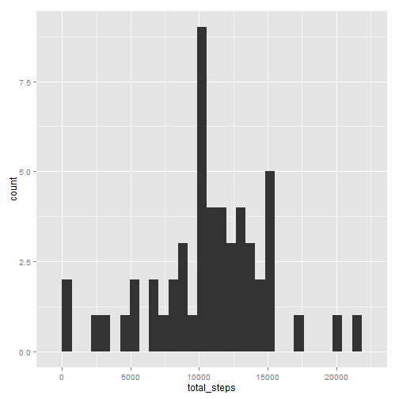
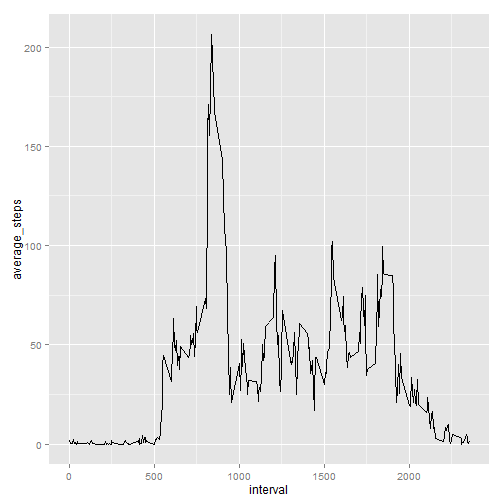
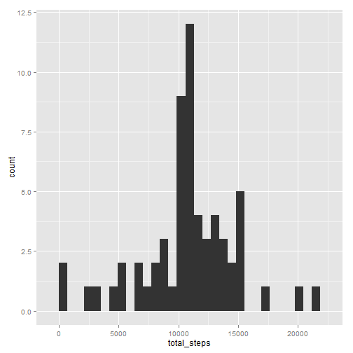
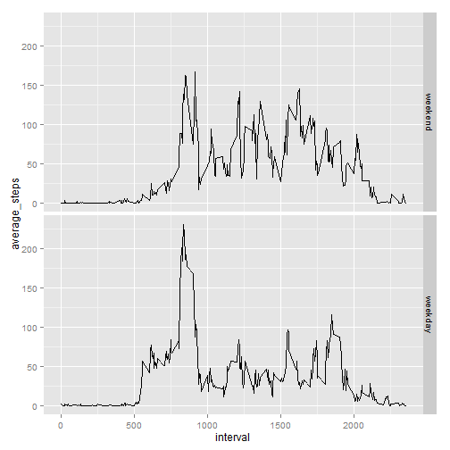

## Loading and preprocessing the data


```r
# read activity data file
activity_data <- tbl_df(read.csv ("activity\\activity.csv"))
# make sure the date column is of class Date
activity_data$date <- as.Date(activity_data$date) 
```
## What is mean total number of steps taken per day?

```r
#remove observations with NA
activity_data_no_na<-activity_data[!is.na(activity_data$steps),]

# calculate total steps taken per day
total_steps_taken_per_day <- activity_data_no_na %>% 
  group_by(date)  %>%
  summarise(total_steps = sum(steps))
```

###Following is the histogram of total steps taken per day:

```r
#create a histogram of steps taken per day
qplot(total_steps, data = total_steps_taken_per_day, geom = "histogram")
```

 

###Mean and median of total steps taken per day are:

```r
mean(total_steps_taken_per_day$total_steps)
```

```
## [1] 10766.19
```

```r
median(total_steps_taken_per_day$total_steps)
```

```
## [1] 10765
```


## What is the average daily activity pattern?


```r
#Calcluate average steps taken per interval acrossall days
average_steps_taken_by_interval <- activity_data_no_na %>% 
  group_by(interval)  %>%
  summarise(average_steps = mean(steps))
```
###Following is the time series graph of average steps taken per interval. 

```r
qplot(interval, average_steps, data = average_steps_taken_by_interval, geom = "line") 
```

 

###Following is the interval with the max average steps taken accross all days

```r
(average_steps_taken_by_interval %>%
  filter(average_steps == max(average_steps)))$interval
```

```
## [1] 835
```

## Imputing missing values
###Following is the numberof observations with missing data:

```r
nrow(activity_data[is.na(activity_data$steps),])
```

```
## [1] 2304
```

### Strategy to impute missing data:
A simple stretegy to replace NAs with mean steps for intervals is applied.

```r
library(plyr)
impute.mean <- function(x) replace(x, is.na(x), mean(x, na.rm = TRUE))
fixed_activity_data <- ddply(activity_data, ~interval, transform, steps = impute.mean(steps))
detach("package:plyr", unload=TRUE)
```


```r
total_steps_taken_per_day <- fixed_activity_data %>% 
  group_by(date)  %>%
  summarise(total_steps = sum(steps))

qplot(total_steps, data = total_steps_taken_per_day, geom = "histogram")
```

 

It is observed that even though the total number of step have increased as expected, applying the above mentioned strategy to replace missing step data with interval mean hasnt changed the overall distribution.

###Mean and median of total steps taken per day are:

```r
mean(total_steps_taken_per_day$total_steps)
```

```
## [1] 10766.19
```

```r
median(total_steps_taken_per_day$total_steps)
```

```
## [1] 10766.19
```

It is also observed that the mean and median of the overall data hasnt changed from original data with missing observations.

## Are there differences in activity patterns between weekdays and weekends?


```r
#create a vector ofall the weekdays
weekdays1 <- c('Monday', 'Tuesday', 'Wednesday', 'Thursday', 'Friday')

#add a factor column to distinguish between weekends and weekdays 
fixed_activity_data$wDay <- factor((weekdays(fixed_activity_data$date) %in% weekdays1), 
                   levels=c(FALSE, TRUE), labels=c('weekend', 'weekday') )

#calculate average steps taken by interval and weekday type 
average_steps_taken_by_interval_and_wday <- fixed_activity_data %>% 
  group_by(interval,wDay)  %>%
  summarise(average_steps = mean(steps))
```

###Following is the comparison of activity pattern between weekdays and weekends

```r
qplot(interval, average_steps, data = average_steps_taken_by_interval_and_wday, facets=wDay~., geom = "line") 
```

 
